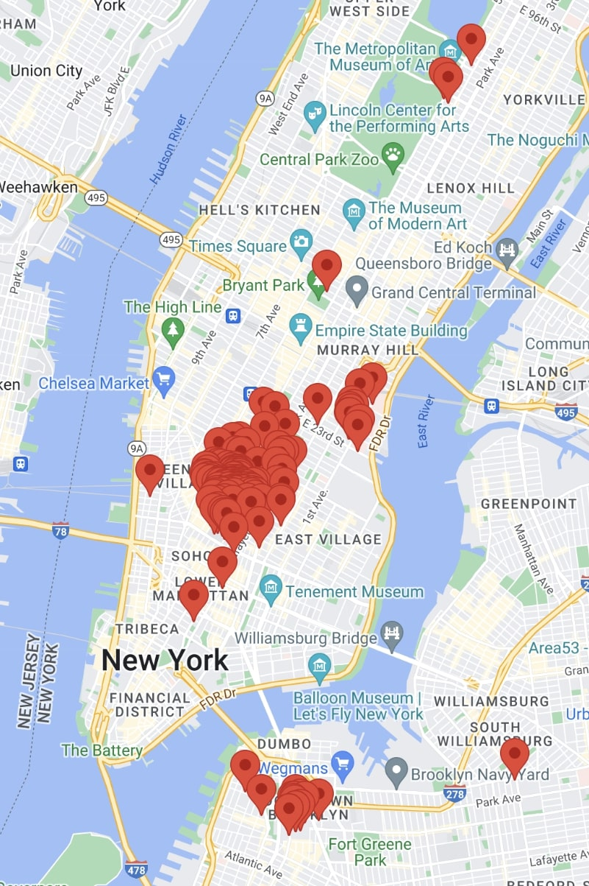
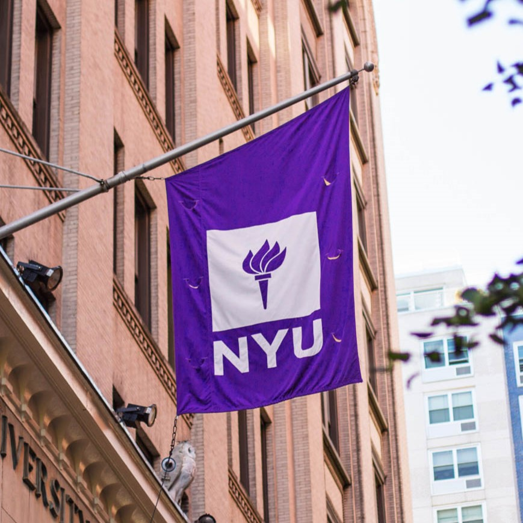

# Studying as an Exchange Student at NYU

## About an Exchange Student Program
### What is an Exchange Student Program?
Exchange Student Program is little different from studying abroad.
 If you just study overseas, that's studying abroad.
 Exchange Student Program is more specific than studying abroad.
 Your school and your partner's school had an agreement to 'exchange' their students to provide an opportunity to study abroad.

### Tuition and Expenses?
You don't have to pay tuition for your partner school, and you can also transfer credits back to home university after studying at exchange school.
 
 So I didn't pay NYU tuition, which is 6 times more expensive than our tuition!! **HAHA**
 But still, I had to pay for housing, food, health insurance, and all the other stuffs exepct for tuition.
 Some students get government or private scholarship, but it's not a case for all students. 

### How Long?
Exchange Students usually study one or two semesters at their partner's school.
 It depends on people how long they want to study there.
 As I'm in mechanical engeering, I had to go back and study core courses, so I just stayed for a semester.
 But Some of my friends stayed one year.

## About New York University
New York University(NYU) was founded in 1832, and is a prviate universeity in New York City.
  The main campus is located near Washington Square Park, but there is no 'campus town' or 'campus area'. Buildings are all scattered over the New York City.
  NYU Main Campus is organized into 10 undergraduate schools, and 15 graduate schools.
  Also, it has global university system with degree-granting portal campuses at NYU Abu Dhabi in UAE and NYU Shanghai in China
  For more information, refer to [Wikipedia](https://en.wikipedia.org/wiki/New_York_University), [NYU offical website](https://www.nyu.edu/) or google it.

### Location
[NYU Campus Map](https://www.nyu.edu/footer/map.html) 

NYU has no campus area, because it is located in the middle of Manhattan which is one of the busiest and crowded place in the world.
  Instead, you can know its building by finding a flag outside of the building.
  Main Campus is located at Manhattan, near Washington Square Park, and NYU Tandon school of engineering is located at Downtown Brookyn.

### Interesting Facts
* NYU Tandon school of Engineering was not a school of NYU. It was originally Polytechnic University, but merged with NYU and changed its name to NYU Tandon School of Engineering resulted by a gift of $100 million from Chandrika and Ranjan Tandon in 2015.
* 

### Perks
* Museums 
* Broadway shows
* Met Opera
* Deli store NYU Discount

## Reason Why I wanted to study in US

## Reminder
