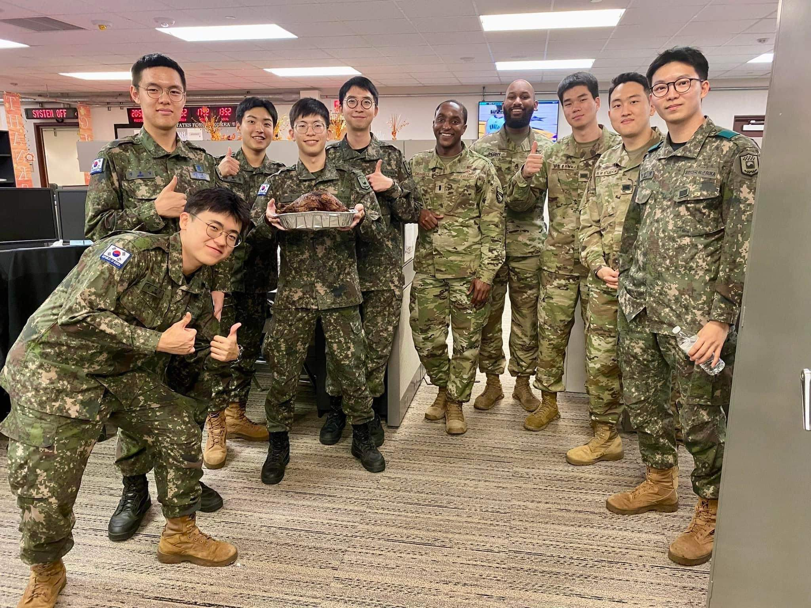

# What I learned from my 23 years of life

## Get good at what you're interested in
 Jim Keller, one of the best CPU designer's advice to young people on Lex Fridmann's Podcast.
<iframe width="560" height="315" src="https://www.youtube.com/embed/G4hL5Om4IJ4?si=3Rqw2GpCYKE93dmn" title="YouTube video player" frameborder="0" allow="accelerometer; autoplay; clipboard-write; encrypted-media; gyroscope; picture-in-picture; web-share" allowfullscreen></iframe>

## You cannnot be the smartest person in the room, but you can be the hardest working person.
 Paul McWhorter, youtube guy who spent his life in electrical engineering and now teaching arduino and electrical stuffs for free on online.
<iframe width="560" height="315" src="https://www.youtube.com/embed/sun-qznNXi0?si=8oPkm8l3j7wQ_tGr" title="YouTube video player" frameborder="0" allow="accelerometer; autoplay; clipboard-write; encrypted-media; gyroscope; picture-in-picture; web-share" allowfullscreen></iframe>

## Until you make unconscious consciouss, it will direct your life and you call it fate.

 By Carl G. Jung

## Tis a lesson you should heed, try try again; if at first you don't succeed, try try again

 From Magic Tree House #23 Twister on Tuesday p.38

## If you can't understand for the first time, it's totally fine. But read and read it again and it will all make sense someday

 From my experience in 1.5 years of military service, which was the place I've never known of.
 All of the military concepts and rules weren't familiar to me, but someday, It all made sense.