# LES

## What is LES?

Turbulent flows contain eddies with a range of sizes and energies.
  In LES we will going to resolve eddies with a mesh.
 This is called Large Eddies Simulation, LES.

## How do we do LES?

<strong> Problem </strong>

Of course we can resolve eddies bigger than a mesh using velocity vectors.
 But how about eddies smaller than a mesh?
 The below picture shows the concept of the problem.
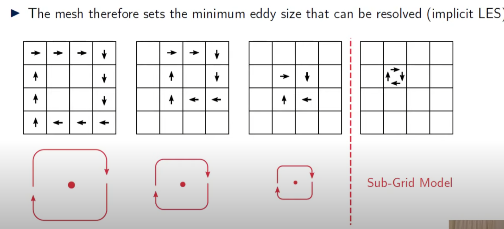 [^1]
  We will going to use sub-grid model that represent eddies smaller than a single mesh size

[^1]: [CFD] Large Eddy Simulation (LES): An Introduction / Fluid Mechanics 101 / [link](https://www.youtube.com/watch?v=r5vP45_6fB4&list=PLnJ8lIgfDbkoPrNWatlYdROiPrRU4XeUA)

## Basic Concept of Eddies

<strong> Wave number </strong>

Wave number indicates the size of the eddy. 
Actually, it is the reciprocal of the size of the eddy.

Wavenumber $k=\frac{2 \pi}{d}$

IDK why the wavenumber is defined like this, but it is how it is.
:::warning
$k$ can also stand for turbulent kinetic energy, so do not be confused.
:::

<strong> Turbulent Energy Cascade </strong>

This section will tell you what turbulend energy cascade is.
 You 

The below diagram shows the relation between the size of the eddy(wavenumber) and the kinetic energy density.
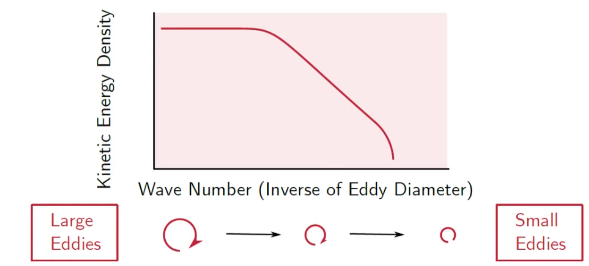
 
 
The area under the curve is the turbulent kinetic energy, TKE.
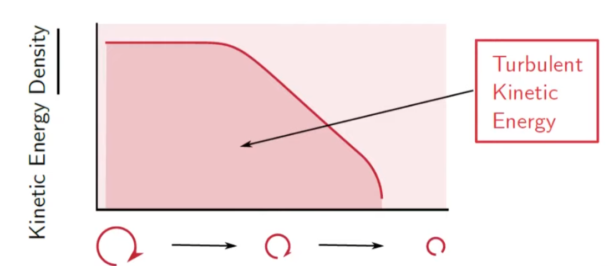
 
 
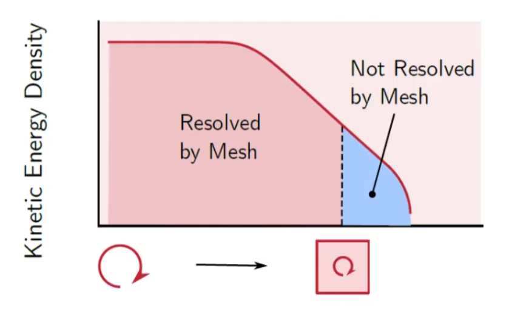
As we can't shrink the size of the mash to infinitesimal size, there's a certain point that we cannot resolve eddies using cells.
 If the blue area is smaller than 20%, we call it Good LES.
 IDK know why, but this is kind of convention.
 
 
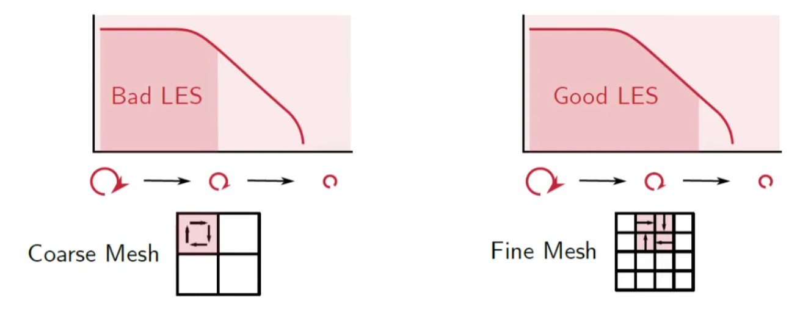

<strong> Integral length scale </strong>

The eddy size and energy will obviously vary throughout the domain.
It means, each domain has different TKE, because they all have different kinetic energy density.

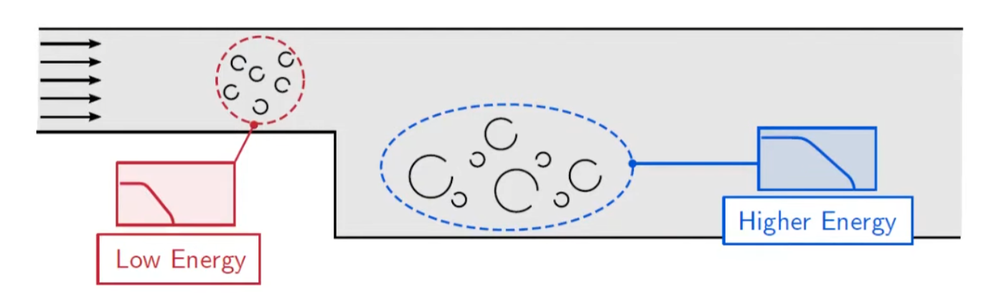
 
 
So we will have something called 'integral length scale which is representative of all the eddies at a location.
 Because it is easier to look at a single value than the spectrum.
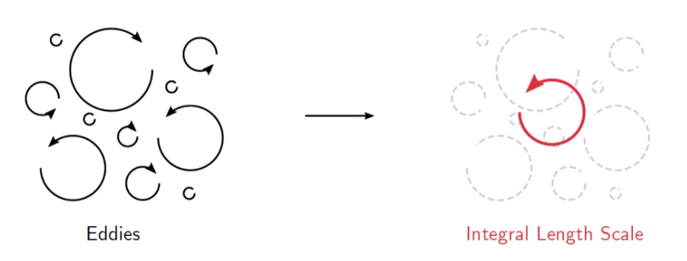
 
 
integral length scale is simply size of the averaged energy density eddy.
 The area devided by integral length scale is the same.
 We can calculate it by mathematical expression.
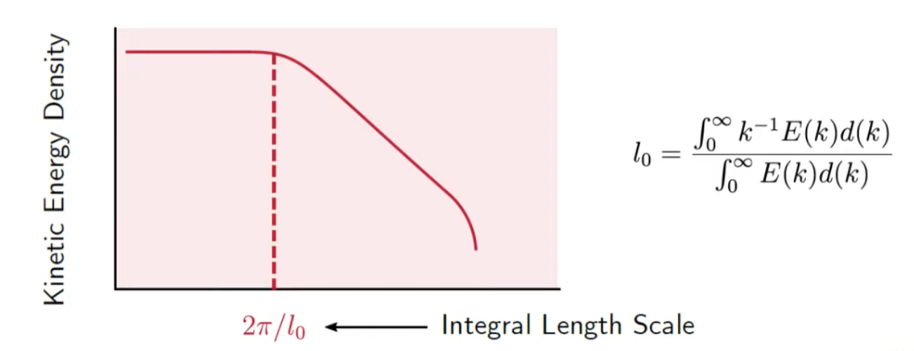
 
 
But the above mathematical expression is a bit absurd,as we don't know the function of energy density.
 So how can we calculate it?
 We can calculate $l_0$ from a precursor RANS calculation using either $k-w$ or $k-\epsilon$ model.
:::danger Question
So in order to do LES, do we have to do RANS first? what if RANS is not accurate?
:::

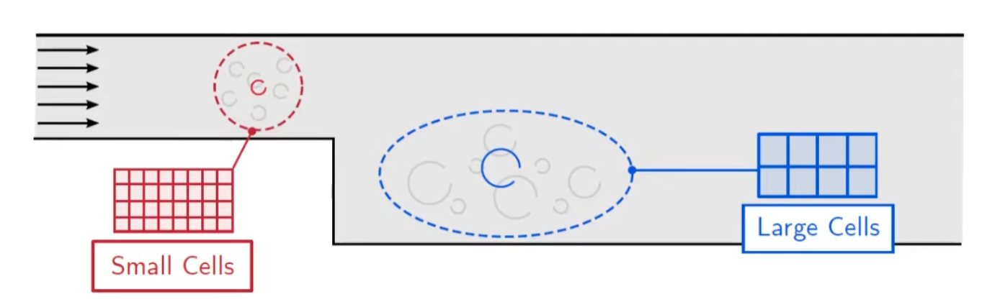
 
 
We said the good LES should resolve more than 80% of energy density.
 In order to to this, the size of a cell should be smaller than one fifth of the integral length scale.
 So that we can resolve more than 80% of the turbulent kinetic energy.
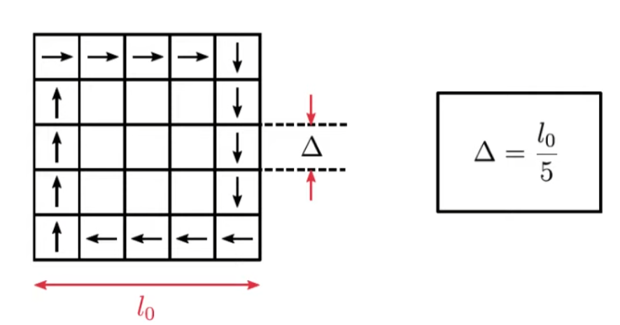
 
 
So if we want to evaluate if the mesh is good or not, we can define a new function f with variable integral length scale $l_0$ and cell volume $\Delta$
$$
f=\frac{l_0}{\Delta}=\frac{k^{2/3}}{\epsilon \ast \Delta}
$$
$\epsilon$ and $k$ is from the relations above.

## How LES works - Process

<strong> 0. Approach </strong>

As we discussed above, good LES should resolve more than 80% of the TKE. 
 So our goal is to resolve more than 80% of the TKE.

<strong> 1. Calculate the Mean Velocity </strong>

First, we will going to calculate the mean velocity of the flow.
 As the CFD Code computes the instantaneous velocity $U$, we will going to time average $U$ and get mean velocity $\bar{U}$
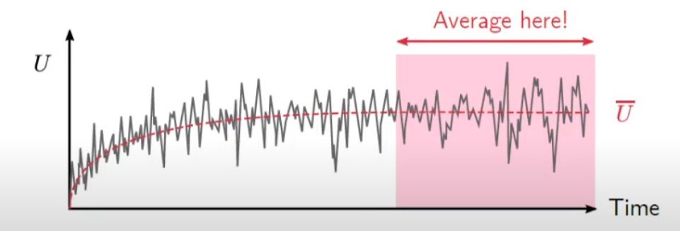
:::warning Question
How do we get U? What if U is inaccurate?
:::
We will average the velocity after the trasient phase.

<strong> 2. Fluctuating Velocity </strong>

We will do almost the same process as RANS
$$
U=\bar {U} + u'
$$
:::tip
Difference between RANS and LES is, 
 RANS models the fluctuation terms using time averaged velocity terms,
 But LES calculates TKE in the fluctuation terms.
:::
  As we all know, kinetic energy per mass is $\frac{1}{2}u^2$,
 So we can multiply fluctuating velocity components together, and it will lead us to some kinetic energy term.
 
  We have three veolcity components, $u,v,w$ in each directions, so we will have 9 possible combinations,
 $u'u'$, $u'v'$, $u'w'$, $v'u'$, $v'v'$, $v'w'$, $w'u'$, $w'v'$, $w'w'$
 There are instaneous Reynolds-Stresses that are resolved by the mesh
 But, only normal components are used to calcaulte the resolved TKE.($u'u'$, $v'v'$, $w'w'$)
:::warning Question
IDK why we only use normal components for the TKE.
 This is probably because of the definition of energy
:::
And then, we time-average all those Reynolds-Stresses, and get Reynolds Stress tensor per unit density.
:::warning Question
IDK why we time-average reynolds stresses.
:::
Anyways, we get Reynolds STress tensor per unit density.
$$
\frac{R_{ij}}{\rho}= 
\begin{bmatrix}
\overline{u'u'} & \overline{u'v'} & \overline{u'w'} \\[0.3em]
\overline{v'u'} & \overline{v'v'} & \overline{v'w'} \\[0.3em]
\overline{w'u'} & \overline{w'v'} & \overline{w'w'} \\[0.3em]
\end{bmatrix}=
\begin{bmatrix}
\overline{u'u'} & \overline{u'v'} & \overline{u'w'} \\[0.3em]
 & \overline{v'v'} & \overline{v'w'} \\[0.3em]
 &  & \overline{w'w'} \\[0.3em]
\end{bmatrix}
$$

<strong> 3. Resolved Turbulent Kinetic Energy </strong>

From the diagonal components, we get resolved TKE,
$$
k_{res}=\frac{1}{2}(\overline{u'u'}+\overline{v'v'}+\overline{w'w'})
$$
just using normal components.

 The reason why it is called resolved TKE is, we resolved turbulent kinetic energy only by using out mesh. 
 This is the best we can do here.
 We can't resolve TKE smaller then a cell right now, but we will do this later.

:::tip
OpenFoam will calcaulte the resolved turbulent kinetic energy directly from the mesh, adding up diagonal components.
 However, in ANSYS, they will calculate $\sqrt{\overline{(u')^2}}$which is RMSE(Root Mean Square Error) so you have to square it and then add up the components.
 So be aware of which components you are adding up.
:::

The image shows the rewolved TKE
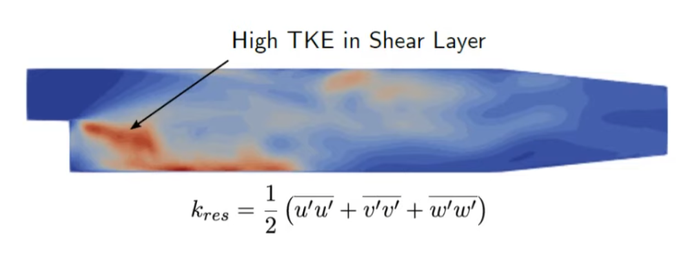

<strong> 4. Total Turbulent Kinetic Energy </strong>

We now have the resolved inetic energy which is only a portion of total TKE.
 We still don't have sub-grid scale TKE,  $k_{sgs}$ 

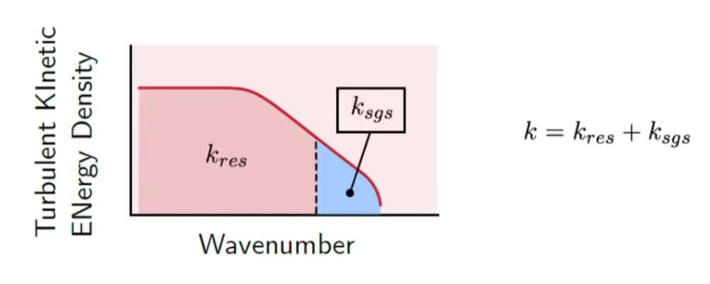

 So our next goal is to get sub-grid scale TKE.

<strong> 5. Sub-Grid Scale Turbulent Kinetic Energy </strong>

$k_{sgs}$ is the TKE of the eddies smaller than the mesh size.
 But how do we do this?

$k_{sgs}$ depends on the method you choose to determine it.
 There are several methods like smagorinky, WALE, etc.
 We will cover this later on.
 
 But the easiest one is solving kinetic energy transport model.
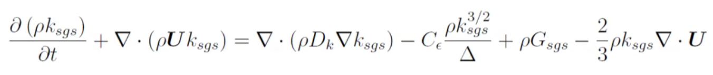
 What about other methods?
 One way is to calculate $k_{sgs}$ from sub-grid legnth scale $l_{sgs}$
 $l_{sgs}$ has the same concept as integral length scale $l_0$
 $l_{sgs} represents the size of eddies within the cell.
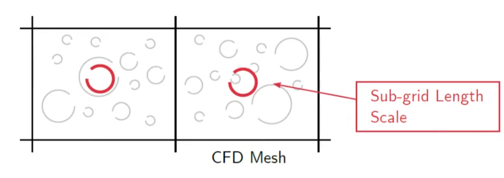

:::tip
OpenFOAM calculates $k_{sgs}$ for you.
But in ANSYS, you have to calculate it by yourself in post-processor.
:::

<strong> 6. Sub-Grid Length Scale </strong>

$l_{sgs}$is defined as
$$
l_{sgs}=C_s \ast {(Cell Volume)}^{1/3}
$$

If $C_s=0.1$ this is Smagornisky coefficient.

 But, if we look at some of CFD mannuals, we can see that formula is slightly modified.
 This is because near the walls, eddies are damped, so we modify the function.
 If we are so close to the wall, we will have smaller eddies than we calculated from above.
 So, modified formula is
$$
l_{sgs}=min(\kappa y, C_s\Delta^{1/3}), \kappa=0.41
$$
 This also represents the effect of high aspect ratio.
 This will have better approximation.

<strong> 7. Turbulent Kineitc Energy </strong>

Now, we have calculated $k_{res}$ and $k_{sgs}$
 Below two picture shows $k_{res}$ and $k_{sgs}$
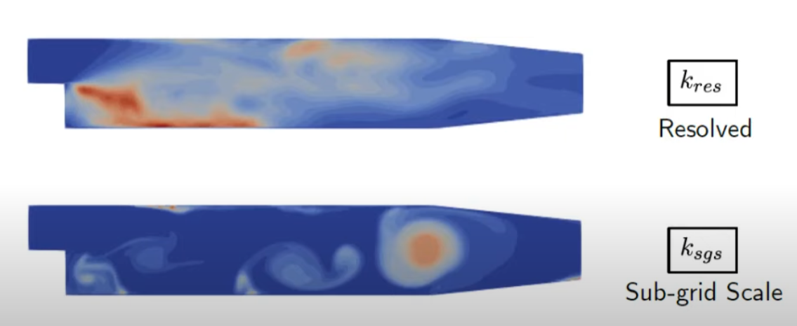

 If we want to check the quality of our CFD, we can calculate the ratio $\frac{k_{res}}{(k_{res}+k_{sgs})}$ and we want >0.8 in the entire domain.

<strong> 8. Mesh Refinement </strong>

If we don't have good quality, we can refine the mesh and increase $k_{res}$ so that we can resolve tubulent kinetic energy.

