# LES

## What is LES?

Turbulent flows contain eddies with a range of sizes and energies.
  In LES we will going to resolve eddies with a mesh.
 This is called Large Eddies Simulation, LES.

## How do we do LES?

  <!---problem-->
 
<strong> Problem </strong>

 Of course we can resolve eddies bigger than a mesh using velocity vectors.
  But how about eddies smaller than a mesh?
  The below picture shows the concept of the problem.
 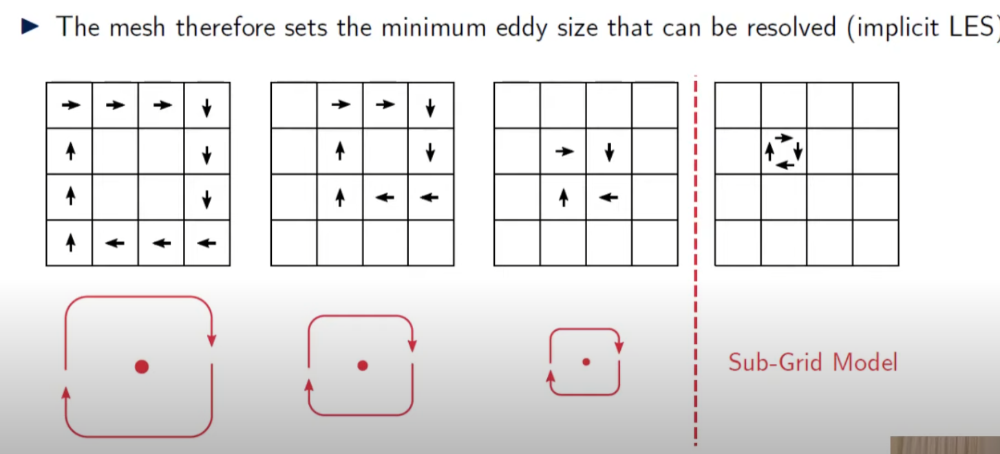 [^1]
   We will going to use sub-grid model that represent eddies smaller than a single mesh size

[^1]: [CFD] Large Eddy Simulation (LES): An Introduction / Fluid Mechanics 101 / [link](https://www.youtube.com/watch?v=r5vP45_6fB4&list=PLnJ8lIgfDbkoPrNWatlYdROiPrRU4XeUA)

## Basic Concept of Eddies

<strong> Wave number </strong>

Wave number indicates the size of the eddy. 
Actually, it is the reciprocal of the size of the eddy.

Wavenumber $k=\frac{2 \pi}{d}$

IDK why the wavenumber is defined like this, but it is how it is.
:::warning
$k$ can also stand for turbulent kinetic energy, so do not be confused.
:::

<strong> Turbulent Energy Cascade </strong>

This section will tell you what turbulend energy cascade is.
 You 

The below diagram shows the relation between the size of the eddy(wavenumber) and the kinetic energy density.
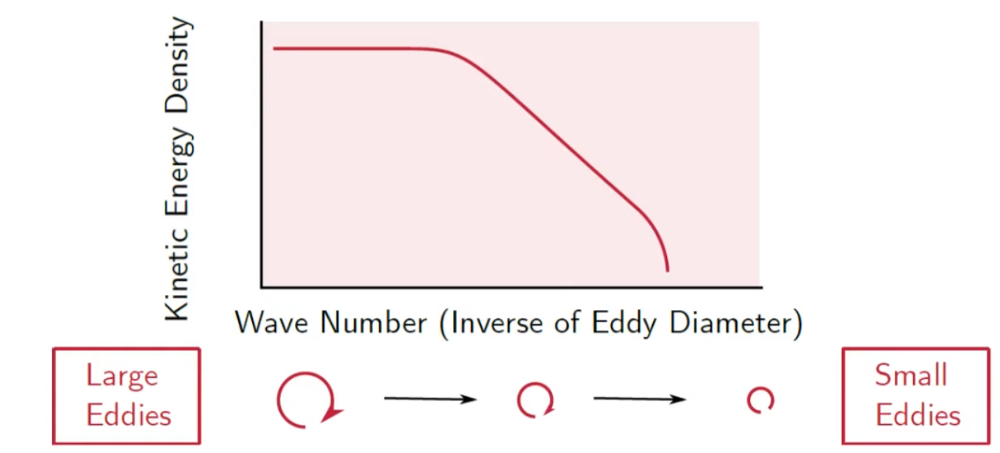
 
 
The area under the curve is the turbulent kinetic energy, TKE.
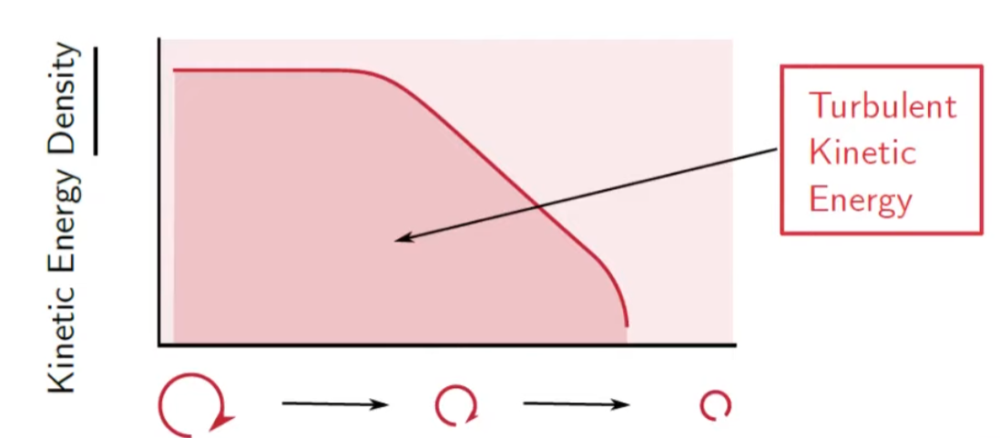
 
 
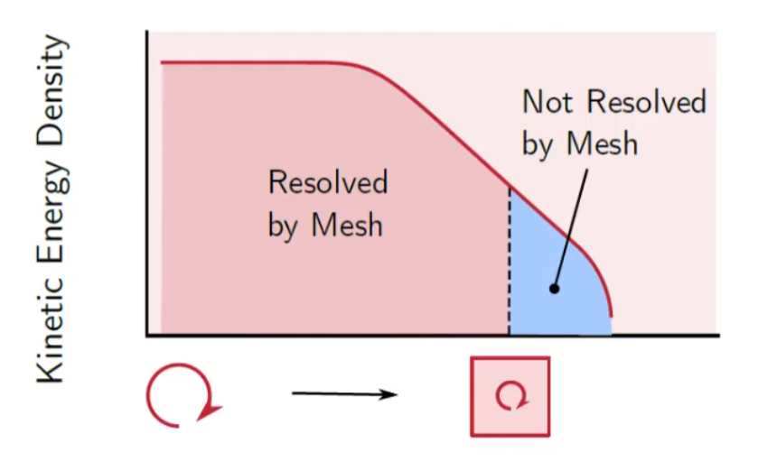
As we can't shrink the size of the mash to infinitesimal size, there's a certain point that we cannot resolve eddies using cells.
 If the blue area is smaller than 20%, we call it Good LES.
 IDK know why, but this is kind of convention.
 
 
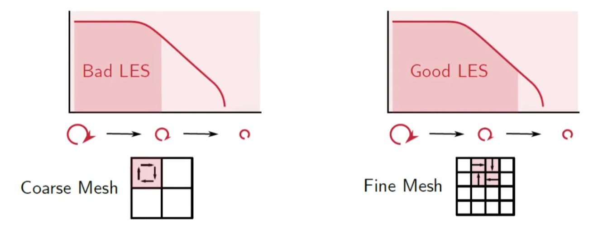

<strong> Integral length scale </strong>

The eddy size and energy will obviously vary throughout the domain.
It means, each domain has different TKE, because they all have different kinetic energy density.

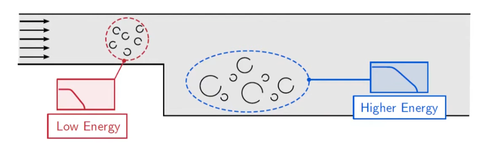
 
 
So we will have something called 'integral length scale which is representative of all the eddies at a location.
 Because it is easier to look at a single value than the spectrum.
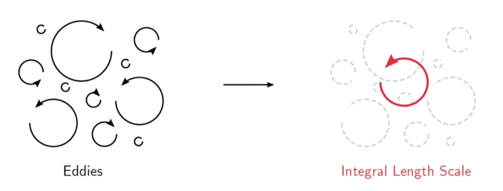
 
 
integral length scale is simply size of the averaged energy density eddy.
 The area devided by integral length scale is the same.
 We can calculate it by mathematical expression.
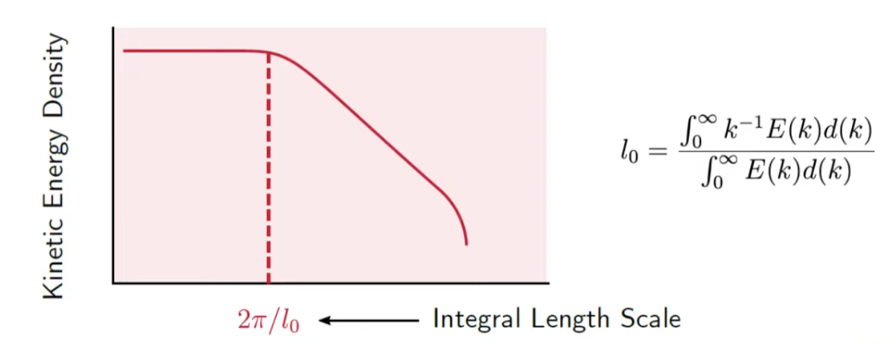
 
 
But the above mathematical expression is a bit absurd,as we don't know the function of energy density.
 So how can we calculate it?
 We can calculate $l_0$ from a precursor RANS calculation using either $k-w$ or $k-\epsilon$ model.
:::danger Question
So in order to do LES, do we have to do RANS first? what if RANS is not accurate?
:::
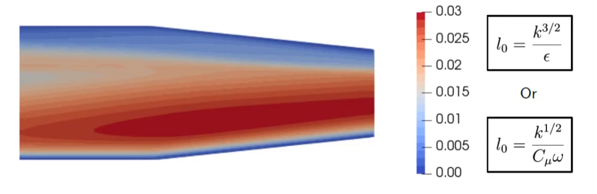
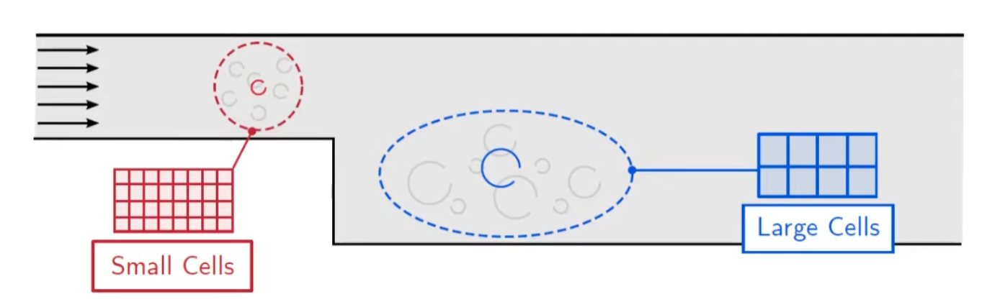
 
 
We said the good LES should resolve more than 80% of energy density.
 In order to to this, the size of a cell should be smaller than one fifth of the integral length scale.
 So that we can resolve more than 80% of the turbulent kinetic energy.
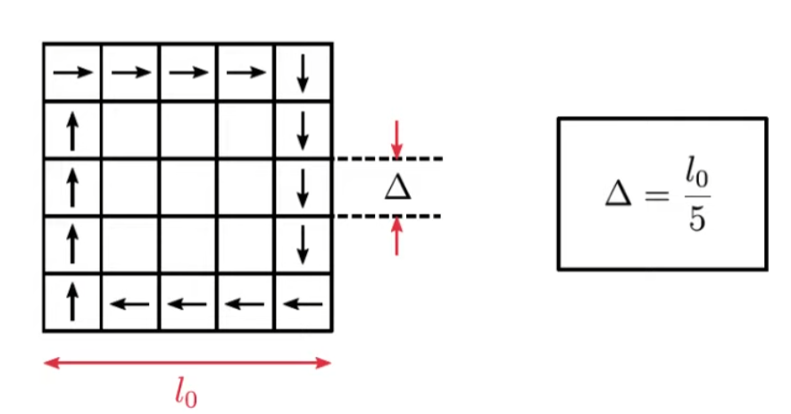
 
 
So if we want to evaluate if the mesh is good or not, we can define a new function f with variable integral length scale $l_0$ and cell volume $\Delta$
$$
f=\frac{l_0}{\Delta}=\frac{k^{2/3}}{\epsilon \ast \Delta}
$$
$\epsilon$ and $k$ is from the relations above.

## How LES works - Process

<strong> 0. Approach </strong>

As we discussed above, good LES should resolve more than 80% of the TKE. 
 So our goal is to resolve more than 80% of the TKE.

<strong> 1. Calculate the Mean Velocity </strong>

First, we will going to calculate the mean velocity of the flow.
 As the CFD Code computes the instantaneous velocity $U$, we will going to time average $U$ and get mean velocity $\bar{U}$
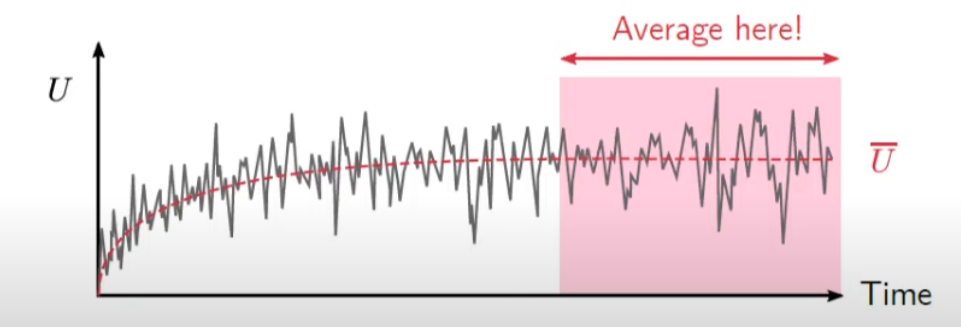
:::warning Question
How do we get U? What if U is inaccurate?
:::
We will average the velocity after the trasient phase.

<strong> 2. Fluctuating Velocity </strong>

We will do almost the same process as RANS
$$
U=\bar {U} + u'
$$
:::tip
Difference between RANS and LES is, 
 RANS models the fluctuation terms using time averaged velocity terms,
 But LES calculates TKE in the fluctuation terms.
:::
  As we all know, kinetic energy per mass is $\frac{1}{2}u^2$,
 So we can multiply fluctuating velocity components together, and it will lead us to some kinetic energy term.
 
  We have three veolcity components, $u,v,w$ in each directions, so we will have 9 possible combinations,
 $u'u'$, $u'v'$, $u'w'$, $v'u'$, $v'v'$, $v'w'$, $w'u'$, $w'v'$, $w'w'$
 There are instaneous Reynolds-Stresses that are resolved by the mesh
 But, only normal components are used to calcaulte the resolved TKE.($u'u'$, $v'v'$, $w'w'$)
:::warning Question
IDK why we only use normal components for the TKE.
 This is probably because of the definition of energy
:::
And then, we time-average all those Reynolds-Stresses, and get Reynolds Stress tensor per unit density.
:::warning Question
IDK why we time-average reynolds stresses.
:::
Anyways, we get Reynolds STress tensor per unit density.
$$
\frac{R_{ij}}{\rho}= 
\begin{bmatrix}
\overline{u'u'} & \overline{u'v'} & \overline{u'w'} \\[0.3em]
\overline{v'u'} & \overline{v'v'} & \overline{v'w'} \\[0.3em]
\overline{w'u'} & \overline{w'v'} & \overline{w'w'} \\[0.3em]
\end{bmatrix}=
\begin{bmatrix}
\overline{u'u'} & \overline{u'v'} & \overline{u'w'} \\[0.3em]
 & \overline{v'v'} & \overline{v'w'} \\[0.3em]
 &  & \overline{w'w'} \\[0.3em]
\end{bmatrix}
$$

<strong> 3. Resolved Turbulent Kinetic Energy </strong>

From the diagonal components, we get resolved TKE,
$$
k_{res}=\frac{1}{2}(\overline{u'u'}+\overline{v'v'}+\overline{w'w'})
$$
just using normal components.

 The reason why it is called resolved TKE is, we resolved turbulent kinetic energy only by using out mesh. 
 This is the best we can do here.
 We can't resolve TKE smaller then a cell right now, but we will do this later.

:::tip
OpenFoam will calcaulte the resolved turbulent kinetic energy directly from the mesh, adding up diagonal components.
 However, in ANSYS, they will calculate $\sqrt{\overline{(u')^2}}$which is RMSE(Root Mean Square Error) so you have to square it and then add up the components.
 So be aware of which components you are adding up.
:::

The image shows the rewolved TKE
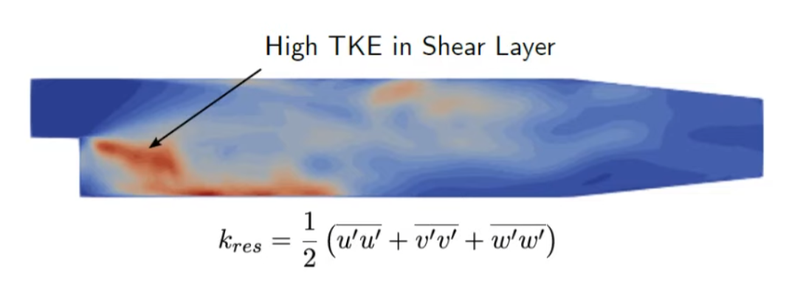

<strong> 4. Total Turbulent Kinetic Energy </strong>

We now have the resolved inetic energy which is only a portion of total TKE.
 We still don't have sub-grid scale TKE,  $k_{sgs}$ 

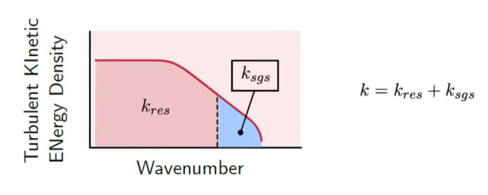

 So our next goal is to get sub-grid scale TKE.

<strong> 5. Sub-Grid Scale Turbulent Kinetic Energy </strong>

$k_{sgs}$ is the TKE of the eddies smaller than the mesh size.
 But how do we do this?

$k_{sgs}$ depends on the method you choose to determine it.
 There are several methods like smagorinky, WALE, etc.
 We will cover this later on.
 
 But the easiest one is solving kinetic energy transport model.
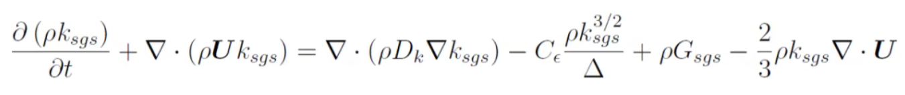
 What about other methods?
 One way is to calculate $k_{sgs}$ from sub-grid legnth scale $l_{sgs}$
 $l_{sgs}$ has the same concept as integral length scale $l_0$
 $l_{sgs} represents the size of eddies within the cell.
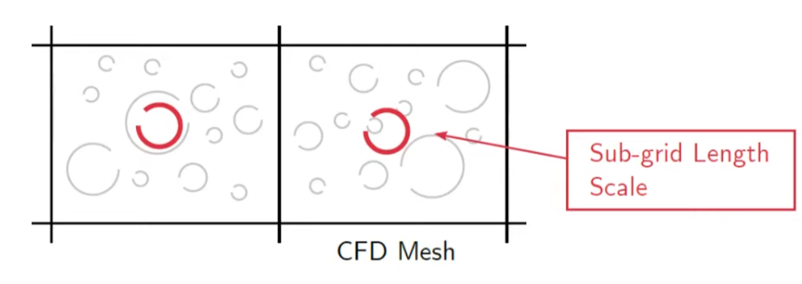

:::tip
OpenFOAM calculates $k_{sgs}$ for you.
But in ANSYS, you have to calculate it by yourself in post-processor.
:::

<strong> 6. Sub-Grid Length Scale </strong>

$l_{sgs}$is defined as
$$
l_{sgs}=C_s \ast {(Cell Volume)}^{1/3}
$$

If $C_s=0.1$ this is Smagornisky coefficient.

 But, if we look at some of CFD mannuals, we can see that formula is slightly modified.
 This is because near the walls, eddies are damped, so we modify the function.
 If we are so close to the wall, we will have smaller eddies than we calculated from above.
 So, modified formula is
$$
l_{sgs}=min(\kappa y, C_s\Delta^{1/3}), \kappa=0.41
$$
 This also represents the effect of high aspect ratio.
 This will have better approximation.

<strong> 7. Turbulent Kineitc Energy </strong>

Now, we have calculated $k_{res}$ and $k_{sgs}$
 Below two picture shows $k_{res}$ and $k_{sgs}$
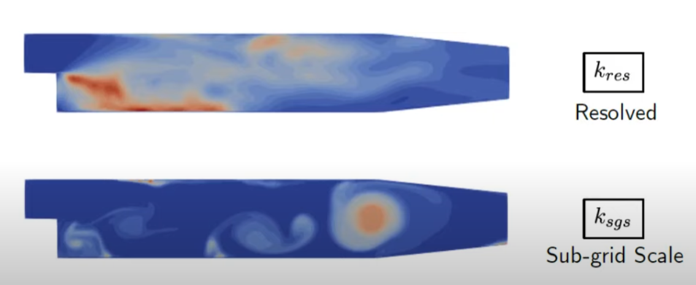

 If we want to check the quality of our CFD, we can calculate the ratio $\frac{k_{res}}{(k_{res}+k_{sgs})}$ and we want >0.8 in the entire domain.

<strong> 8. Mesh Refinement </strong>

If we don't have good quality, we can refine the mesh and increase $k_{res}$ so that we can resolve tubulent kinetic energy.

## LES Sub-Grid Model

<strong> What is Sub-Grid Model? </strong>

 In LES, we looked at resolved TKE and sub-grid TKE.
  There are several sub-grid models, and we have to select one of those models.

<strong> Why do we need Sub-Grid Model? </strong>

 The below picture shows the reason why we need sub-grid model.
  In CFD Solver, the size of eddy cannot be smaller than the size of the cell, and eddies will persist and will not break down.
  But we have to break it down, because that's how mother nature works.
  Eddies get smaller and dissipate into heat.

 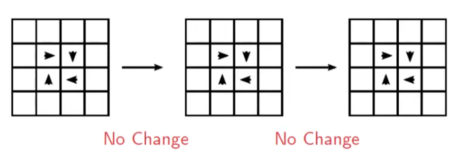

  What can we do to remove eddies from the mesh?
   We can do this by increasing the turbulence dissipation rate.

<strong> What is Turbulence Dissipation Rate? </strong>

 Turbulence Dissipation rate, **$\epsilon$ is the rate that turbulence is converted to thermal energy.**
  It has units of turbulent kinetic energy per unit time.
  We have large $\epsilon$, eddies will quickly be dissipated into heat.
  It's quite straightforward.
   Then what's the mathmatical expression?
  In real turbulence, 
 $$
 \epsilon=\nu \frac{\partial U_i}{\partial x_j}\frac{\partial U_i}{\partial x_j}
 $$
 But this is just mathamteical deifintion.
  How do we calculate it?
  In RANS, we solve transport equation for $\epsilon$, and this was shown in [$k-\epsilon$ model](./RANS.md)
  But this is different in LES.
   
 If we look at below picture, we can see that velocity gradient gets larger as eddies get smaller.
  This means, at first, as velocity grdient is not large, turbulenece dissipation rate is also not large and it takes a while for the eddies to be dissipated.
  However, as time goes by, eddies get smaller and velocity gradient also gets smaller and turbulence dissipation rate will accelerate.

 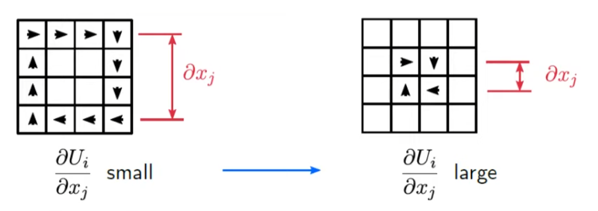

  We know that eddies just bigger than the cell size are not being dissipated, and it means velocity gradient is not decreasing anymore, leading to constant turbulence dissipation rate.
  But our goal is to dissipate eddies. 
  So, we can increase molecular viscosity $/nu$, and it will lead to larger turbulence dissipation rate.
  If the turbulence dissipate rate is high enough, eddies will be dissipated.
  So the mathmatical expression of turbulence dissipation rate will be
 $$
 \epsilon=(\nu+\nu_{sgs}) \frac{\partial U_i}{\partial x_j}\frac{\partial U_i}{\partial x_j}
 $$

 <!--picture-->

 If we select adequte $\nu_{sgs}$ to dissipate eddies just larger than the cell size, our goal is achieved.
  But we should remind that we're not solving turbulence dissipation rate in LES.
  How can we reflect this concept to the real CFD?

 ::: warning Reminder 
 we're not solving $\epsilon$ in LES. 
  solving $\epsilon$ is for RANS equation.
  And above mathematical expression is for real-world fluid.
  We also have to 'model' this in LES.
 :::
 

<strong> Turbulence Dissipation in real LES CFD </strong>

  We looked at the concept of how to dissipate eddies in LES.
  But it was only a concept.
  How do we increase molecular viscoity in LES simulation?
  We do this by modyfing N-S equation

$$
\frac{\partial (\rho U_i) }{\partial t} + \frac{\partial (\rho U_i U_j)}{\partial x_j} = -\frac{\partial P}{\partial x_i} + \frac{\partial}{\partial x_j} (\tau_{ij}+\tau_{sgs})
$$ 

  We can see that extra stress term $\tau_{sgs}$ is added to the N-S equation.
  viscosity stress term $\tau_{ij} + \tau_{sgs}$ does the same role as molecular viscosity.
  As we increased $\tau_{ij}$ to $\tau_{ij} + \tau_{sgs}$, turbulence dissipation will also be increased, and it will dissipate eddies.
  This can be derived by filtering the N-S equation, but we'll going to skip this.

  It's important to know the meaning of sub-grid stress, which is $\tau_{sgs}$ here. 

<strong> Sub-Grid Stress </strong>

 Molecular viscosity $\nu_sgs$ can be represented as Sub-Grid Stress in N-S equation.
 We're going to look at the meaning of Sub-Grid Stress $\tau_{sgs}$ here.
 If we think of eddies smaller than the size of cells, they can be considered as stresses.
 Because eddies exert stresses to fluid particles and wall.
 So we're substituing the concept of eddies into stresses instead of considering the real velocity of the eddies.

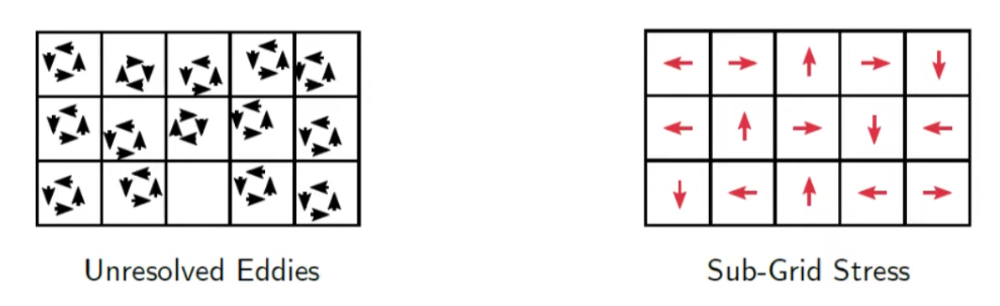

 Sub-Grid Stress can be modeled as 

$$
\tau_{sgs} = 2 \rho \nu_{sgs} S^*_{ij} - \frac{2}{3}\rho k_{sgs} \delta_{ij} 
$$

$$
S^*_{ij} = \frac{1}{2}(\frac{\partial \tilde U_i}{\partial x_j} + \frac{\partial \tilde U_j}{\partial x_i} - \frac{1}{3} \frac{\partial \tilde U_k}{\partial x_k} \delta_{ij})
$$

And this is from eddy viscosity model.
 You can find this on [RANS](./RANS.md) page
 If we see the equation, as the eddies get smaller, velocity gradient increases and it makes Stress tensor $S^*_{ij}$ bigger.
 But $S^*_{ij}$ term depends on the size of the eddy, which means we don't have control for it.
 Instead, we can control $\nu_{sgs}$.
 By controlling $\nu_{sgs}$ we can dissipate the eddy just bigger than the cell size.
 This also means if we have larger cell size, $\nu_{sgs}$ also have to be bigger.
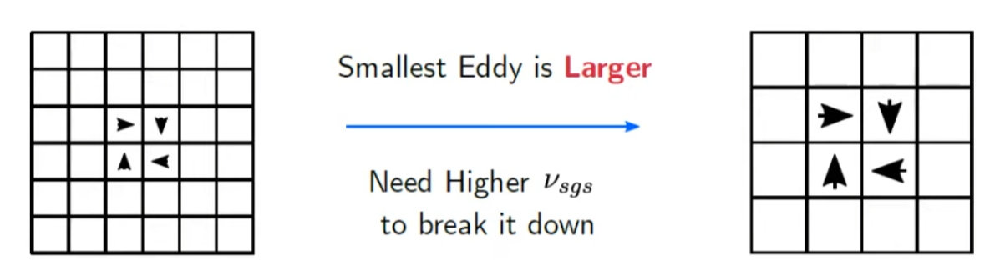

::: tip extra info
$\nu_{sgs}$ is scalar value if we assume that eddies are isotropic, which means shape of the eddies are all same.
:::

::: warning Question
Isn't the eddy viscosity model from the RANS equation?
 so we use eddy viscosity model from the RANS?
 Isn't the RANS inaccuarate?
:::

Because of the cell size - $\nu_{sgs}$ dependence, meshing and LES is incorporated.
 In RANS, we can change the mesh and use the same turbulence model.
 But in LES, as we change the mesh, molecular viscosity $\nu_{sgs}$ also changes.
 This is the characteristic of the LES.

## Smagorinsky Model

As we looked at sub-grid model, we now know that sub-grid stress $tau_{sgs}$ is modelled using an eddy viscosity approach.
 And sub-grid viscosity $\nu_{sgs}$ is the **CONTROL** of dissipation of eddy depending on the cell size.
 So how is sub-grid kinematic viscosity $\nu_{sgs}$ calculated?
 There are several methods, but here, we're considering Smagorinsky model.

<strong> Expressing Sub-Grid Kinematic Viscosity Model </strong>

We can express sub-gird kinematic viscosity model as velocity multiplied by length according to the units of kinematic viscosity.
$$
\frac{[m^2]}{[s]} = \frac{[m]}{[s]} \times [m]
$$

This simple approach was proposed by Smagorinky.
So, 
$$
\nu_{sgs} \sim U_0 \ast l_0
$$

As eddies are isotropic, we only need a length $l_0$ to categorise their shape.

 So our goal is to determine $U_0$ and $l_0$ to get $\nu_{sgs}$

<strong> Velocity Scale </strong>

We are going to take velocity difference $\Delta U$ as a velocity scale here.
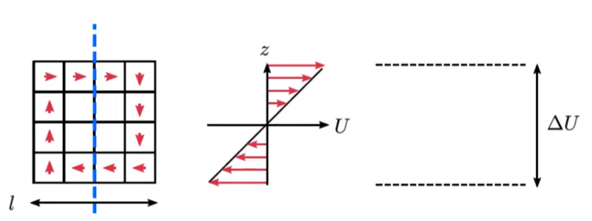
 Velocity difference will be,
$$
U_0 \sim \Delta U = l_0 \ast \frac{\partial U}{\partial z}
$$

 But what if we draw a horizontal line across the eddy?

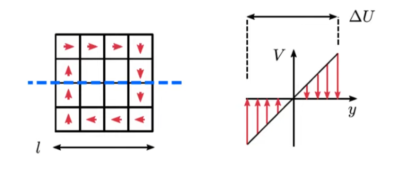

 Velocity difference will be
$$
U_0 \sim \Delta U = l_0 \ast \frac{\partial V}{\partial y}
$$

We can express this term in strain rate tensor $S_{ij}$

$$
S_{ij} = \frac{1}{2}(\frac{\partial U_i}{\partial x_j} + \frac{\partial U_j}{\partial x_i})
$$

 But, the problem is, we need a scalar value for the velocity scale.
 What if we just take magnitude of $S_{ij}$?
 If we look at the simple case(Couette Flow), we can know that 
$$
|S_{ij}|=\sqrt{S_{ij}S_{ij}}=\frac{1}{2} \frac{\partial U}{\partial y}
$$

So we have to multiply $\sqrt{2}$ to the velocity gradient.

<strong> Problem of Simple Smagorinsky Model </strong>

Smagorinsky Model doesn't take wall effect into consideration.
 Wall makes eddy small

<strong> How can we modify sub-grid kinematic viscosity to take wall effect into account? </strong>

There are several ways.
 But we're only going to cover modifying $(C_s \Delta)^2$ 
$$
\nu_{sgs} = (C_s \Delta)^2 \sqrt{2 S_{ij} S_{ij}}
$$

  we can change $\nu_{sgs}$, $(C_s \Delta)^2$, or $\sqrt{2 S_{ij} S_{ij}}$
  Simplest way is to modify $(C_s \Delta)^2$.
  We can do this by using RANS equation - eddy viscosity model

::: warning Question
Still can't get it.
 RANS in LES.... 
 Why is LES accurate then?
:::

from $U^+$ and $y^+$ relation, and especially in logarithmic region, we can get velocity gradient.
  And in log region, reynolds stress is constant which is wall shear stress.
 From these relations, we can quantify the size of the eddy with the varient $y$
 The result will be shown in next section.
::: warning Question
why is reynolds stress constant in log region?
:::

<strong> Quantifying the size of eddy </strong>

In logarithmic region, the mean velocity profile is modelled by 
$$
U^+=\frac{1}{\kappa}log(y^+)+C
$$
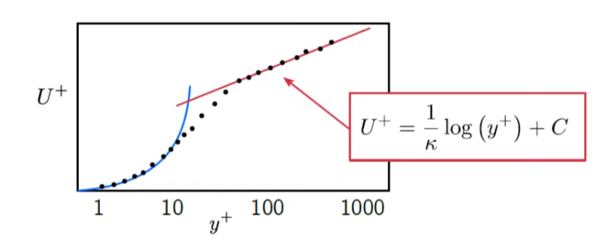
The dots are given from DNS simulation. 
 Also, in logarithmic region, Reynolds shear stress is relatively constant, hence,
$$
-\rho \overline{u'v'} = \tau_w = \rho {u_\tau}^2
$$
::: tip
$\tau_w$ is wall shear stress
 $u_\tau$ is friction velocity which is $\sqrt{\tau_w / \rho}$
 But IDK the physical meaning of these terms.
:::

So, if we plug those equations to Eddy Viscosity Equation $-\rho \overline{u'v'} = \rho \nu_T \frac{\partial U}{\partial y}$, we get
$$
\nu_T = u_\tau \kappa y
$$

The Turbulent Viscosity $\nu_T$ can be written as the product of a length scale and a velocity scale, so, 
$$
\nu_T \sim l \ast U
$$
Turbulent Viscosity $\nu_T$ has the dimension of product of length and velocity.
  So what will be the adequate choice for $l$ and $U$ to represent eddies?
  $l$ will be the mixing length $l_m$ and $u$ will be the reynolds stress $\overline{u'v'}$
::: warning Question
I'm not sure about how $l$ and $U$ relates to mixing length and reynolds stress
:::
 Anyways, if we massage the equation, we get
$$
l_m = \kappa y
$$

So what does it mean?
 As we get close to the wall, $y$ will decrease, and it will make $l_m$ smaller. 
 So this is the behavior that we wanted.
 Taking wall effect into account.
 Now we will return to where we start from, modeling sub-grid scale molecular viscosity $\nu_{sgs}$ which is the control of the dssipation of the eddy.

<strong> Revisiting Sub-Grid Scale  </strong>

Now we have more accurate model for the sub-grid scale eddies.
 So when modeling sub-grid length scale $l_0$, instead of just using Smagorinsky Coefficient $C_s \Delta$, we can use $min$ function. So,
$$
l_0 = min(l_m,C_s \Delta) = min(\kappa y,C_s \Delta)
$$

But our $l_m$ was just for logarithmic region.
 How can we consider other region?
 We can do this by using Van Driest Solution.
 We can get general equation that rerpresent relation between $y^+$ and $U^+$
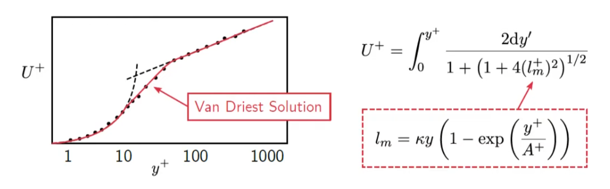

So the final Sub-Grid Length Scale will be 
$$
l_0 = min \Big[\kappa y \ast \Big(1-exp\Big(\frac{y^+}{A^+}\Big)\Big), C_s \Delta]
$$

## Summary of LES

In LES, we have to solve to parts.

1. Resolving larger-than-grid-size-eddies turbulent kinetic energy $k_{res} = \frac{1}{2} \overline{u'u'}+\overline{v'v'}+\overline{v'v'}$
     These values can be solved with 100% accuracy. And it is better to resolve TKE as much as possible.
2. Modelling Sub-grid-sclae Turbulent Kinetic Energy.
     This is the trickies part of LES.

We used turbulence dissipation rate $\epsilon$ to dissipate eddies that are smaller than the cell size.
  By physical definition of $\epsilon$, we can choose adequate molecular viscosity $\nu$ to control the dissipation of eddies. 
$$
\epsilon=\nu \frac{\partial U_i}{\partial x_j}\frac{\partial U_i}{\partial x_j}
$$
 But in real CFD, we can't use this. 
 In order to solve in real CFD, we will use N-S equation to reflect the same phenomenon. 
 We can do this by modifying viscost stress term $\tau_{sgs}$
$$
\frac{\partial (\rho U_i) }{\partial t} + \frac{\partial (\rho U_i U_j)}{\partial x_j} = -\frac{\partial P}{\partial x_i} + \frac{\partial}{\partial x_j} (\tau_{ij}+\tau_{sgs})
$$
 And $\tau_{sgs}$ can be modeled as
$$
\tau_{sgs} = 2 \rho \nu_{sgs} S^*_{ij} - \frac{2}{3}\rho k_{sgs} \delta_{ij} 
$$

 If we control $\nu_{sgs}$, it will effect $\tau_{sgs}$ and this will effect N-S equation and finally reflect the turbulent dissipation rate.

 So how is $\nu_{sgs}$ can be modelled?
 We can do this by using Smagorinsky model, which models $\nu_{sgs}$ as product of $U_0 \ast l_0$.
 $U_0$ is velocity scale and $l_0$ is sub-grid length scale.

 $U_0$ is $l_0 \sqrt{2 S_{ij} S_{ij}}$

 Next step is to model length scale
 The simplest approach is to add some Coffecient to  the cell size because sub-grid eddies is smaller than the size of the Cell.
 So, $l_0 = C_s \Delta$
 And C_s is Sagorinksy Coefficient.
 But the problem is, it cannot take wall effect into account.
 Eddies will get smaller as they approach the wall.
 So, we use reynolds stress to model this.
::: warning Question
This is the huge missing link of LES.
 Why do we use RANS eddy viscosity model to LES?
 Why does this work?
:::

Anyways, if we do some simple math with RANS eddy viscosity model, we get mxing length as the resprentative of size of the eddies.
$$
l_m = \kappa y \ast \Big(1-exp\Big(\frac{y^+}{A^+}\Big)\Big)  
$$
 So as a result we get sub-grid length which represents the size of sub-grid eddies as,
$$
l_0 = min \Big[\kappa y \ast \Big(1-exp\Big(\frac{y^+}{A^+}\Big)\Big), C_s \Delta]
$$
And this takes wall effect into account.

 I will resummary the above summary.
sub-grid length scale $l_0$ represents the size of the eddy and this will effect molecular viscosity $\nu_{sgs}$ and this will effect viscous stress term $\tau_{sgs}$ and finally effecting N-S equation.

$$
l_0 = min \Big[\kappa y \ast \Big(1-exp\Big(\frac{y^+}{A^+}\Big)\Big), C_s \Delta]
$$
$$
\nu_{sgs} = {l_0}^2 \sqrt{2S_{ij}S_{ij}}
$$
$$
\tau_{sgs} = 2 \rho \nu_{sgs} S^*_{ij} - \frac{2}{3}\rho k_{sgs} \delta_{ij} 
$$
$$
\frac{\partial (\rho U_i) }{\partial t} + \frac{\partial (\rho U_i U_j)}{\partial x_j} = -\frac{\partial P}{\partial x_i} + \frac{\partial}{\partial x_j} (\tau_{ij}+\tau_{sgs})
$$

## testing pdf

<iframe src="./Charge_to_Mass_Ratio_of_the_Electron.pdf" style="width: 100%; height: 700px;" type="application/pdf"></iframe>
