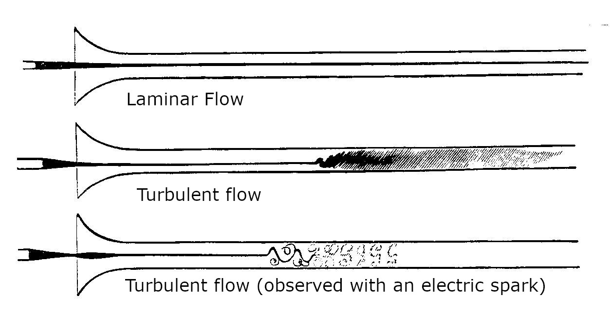
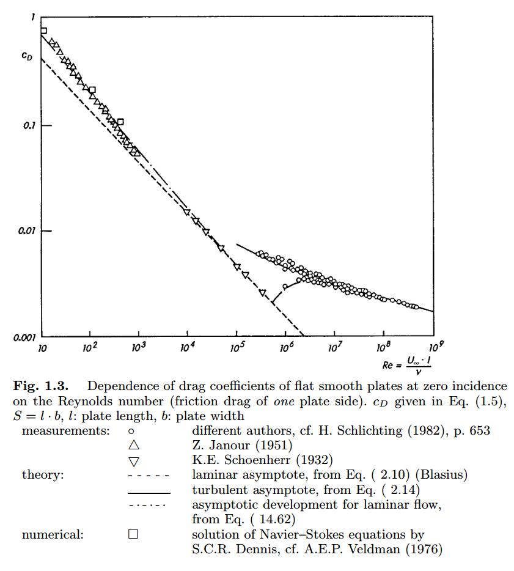

# Fundamentals of Fluid Dynamics

## Reynolds Number

<strong> Importance of Reynold Number </strong>

Before we begin, Reynolds number is one of the most important concept in fluid dynamics.
 Because, this number is 'dimensionless'
 Advantages of dimensionless number is efficiency.
 Suppose that we want to find a equation that represent lift with several vairables and find a relationship; linear, log scale, smth like that.
 To find this relationship, we have to change magnitute of variables one by one.
 If we have 4 variables that represent lift($\rho,V, D, \mu$) and change it's value one at a time and conduct experiments, it would take ages.
 If we conduct 10 experiments for one variable, it will be total $10^4$ experiments.
 But, if we have relationship between these variables, we can just change one variable per experiment.
 This is the power of dimensionless number, and we call it **Nondimensionalizing**
 
 We have many dimensionless numbers, but most important and famous dimensionless number is Reynolds number.

<strong> What is Reynolds Number? </strong>

The physical interpretation of Reynolds Number is ratio of intertial force to friction(viscous) force.

$$
Re = \frac{\rho V d}{\mu} = \frac{Vd}{\nu}  
$$ 
[^1]

where 
* $\rho$ is density, $(kg/m^3)$
* $V$ is flow speed, $(m/s)$
* $d$ is a characteristic length, $(m)$
* $\mu$ is the dynamic viscosity of the fluid, $(Pa·s$ or $N·s/m^2$ or $kg/(m·s))$
* $\nu$ is the kinematic viscosity of the fluid $(m^2/s)$

 As we have *relatively* small reynolds number, it means friction force is larger than inertial force and this is laminar flow.
 But if we have *relatively* large reynolds number, it means the opposite and this represents turbulent flow which is chaotic.
:::warning
Definition of laminar flow and turbulent flow should be established.
 Also, currently I'm not sure that what causes laminar flow to be turned into turbulent flow
:::

<strong> Who invented it? </strong>

From *White, F. M. (2008). Fluid mechanics. The McGraw Hill Companies,. pg.314,* it states it was propsed by Reynolds in 1883, but according to [Wikipedia_Reynolds Number](https://en.wikipedia.org/wiki/Reynolds_number), it was introduced by George Stokes in 1851.
 Anyways, Reynolds Number was widely used after Reynolds, by explaining transition of laminar flow to turbulent flow in the pipe.

 Details should be confirmed from the original text by Stokes_185 *(On the Effect of the Internal Friction of Fluids on the Motion of Pendulums)* and Reynolds_1883 *(An experimental investigation of the circumstances which determine whether the motion of water shall be direct or sinuous, and of the law of resistance in parallel channels)*

<strong> How do we derive it? </strong>

There are several ways to derive it.
 
 From *Schlichting, H., & Gersten, K. (2016). Boundary-layer theory. springer., pg. 6-12*,
 It derives by definition of inertial force per unit volume $\rho u \frac{\partial u}{\partial x}$ and definition of friction force per unit volume $\mu \frac{\partial^2 u}{\partial y^2}$. (You know, from taylor series. For details, look at *Pritchard, P. J., & Mitchell, J. W. (2016). Fox and McDonald's introduction to fluid mechanics. John Wiley & Sons., 5.4 Momentum Equation)*
 And ratio of two forces will be same for *mechanically smiliar* objects.
 So if two different objects have similar size and similar flow, the ratio of forces will be the same eventhough the size is different.
 IDK how this works, but it just says so.
 From the ratio of inertial force to friction force,
 The book states that flow field $u$ is proportional to the free stream velocity $V$, so $u=V$(it can be treated like this) and characteristic length dimension of the body will be a diameter of a sphere $d$ (If we consider sphere in a stream).
 
 Also, by using Buckingham Pi Theorem, we can make dimensionless numbers.
 Details are shown in *Pritchard, P. J., & Mitchell, J. W. (2016). Fox and McDonald's introduction to fluid mechanics. John Wiley & Sons. 7.2 Buckingham Pi Theorem*

:::warning
Characeristic length can be other length dimension, length of the plate, momentum thickness(will discuss later), etc. according to *Pritchard, P. J., & Mitchell, J. W. (2016). Fox and McDonald's introduction to fluid mechanics. John Wiley & Sons., pg. 295*
 IDK why $\partial x$ term and $\partial y$ term can be characteristic length $d$ like diameter of the sphere, but it says so.
:::

<strong> Various Reynolds Number </strong>

* At the pipe

* At the flat plate

* At the airfoil

<strong> Summary </strong>

The most important thing about Reynolds number is dimensionless coefficient(Drag coefficient, Lift Coefficient, etc.) of different variables $(\rho, d, V, \mu)$ are ultimately only dependent on the one variable $Re$
The below image shows the dependence of reynolds number and drag coefficient.

<strong> Questions </strong>

* What is *mechanically simiilar* actually? If two objects and flowstream of two'looks'similar, is it mechanically similar?
* I don't get the concept of characteristic length. Can we just choose one characterisic length as we want?
* So the ratio of intertial force and frcition force is not an absolute value and it can change. Then Reynolds Number represents the ratio of certain geometry? So like we can only compare Reynolds Number between *mechanically similar* objects?

[^1]: Schlichting, H., & Gersten, K. (2016). Boundary-layer theory. springer., pg. 7

## laminar - turbulence transition