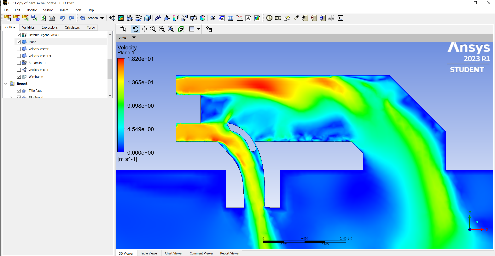
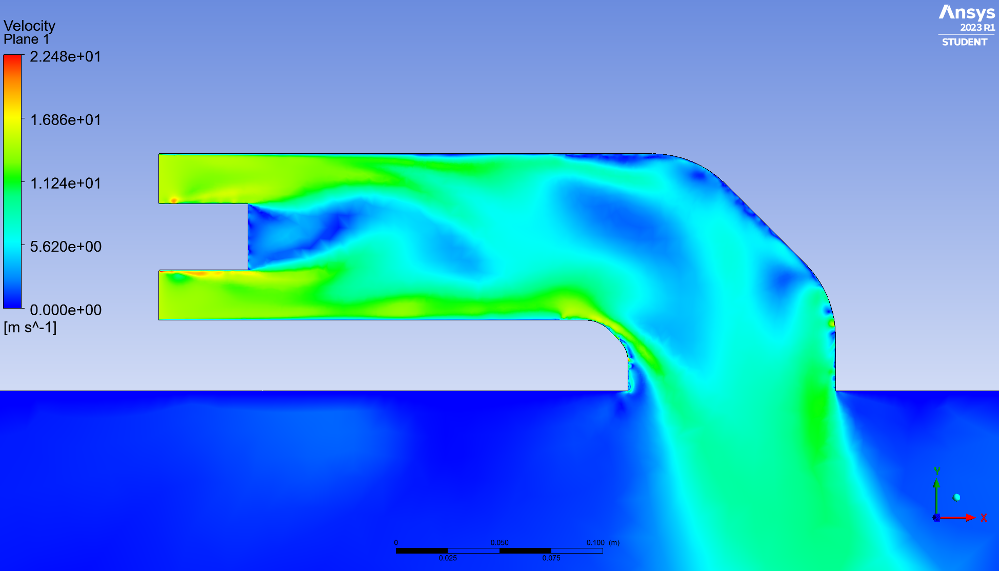
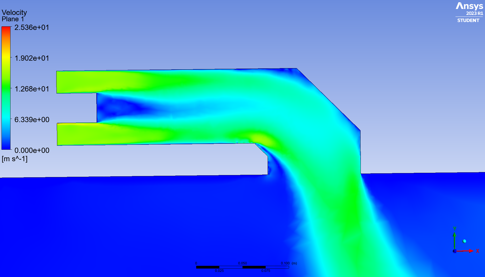
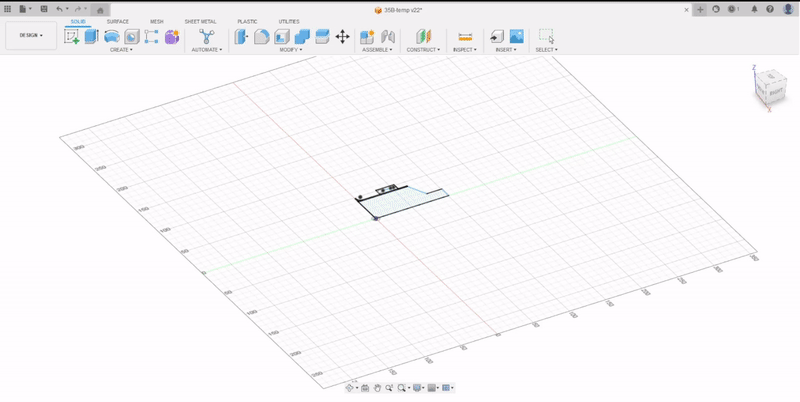

# Making F-35 

## Hardware

Hardware was the most easiest part for us.

My friend and I are both used to 3D Modeling and 3D Printing.

I designed the vertical EDF (Electric Duct Fan), fuselage and roll post nozzle part and my friend designed the rear nozzle which is called 3BSM(3 Bearing Swivel Nozzle)

Before we designed our F-35, we conducted [CFD](https://en.wikipedia.org/wiki/Computational_fluid_dynamics)(Computational Fluid Dynamics) analysis using Ansys Fluent.
 We tried to minimize the thrust loss in roll post nozzle and 3BSM.
 In roll post nozzle, we roughly estimated the thrust loss, and the thrust loss seemed okay.
 In 3BSM, we estimated the thrust loss due to the curve of the nozzle, and it seemed okay as well.
 The limitations were, we couldn't calculate the actual thrust and the meshes and initial conditions might not be precise. 
 However, we could just visually estimate the thrust loss.

The results are like below.
 

 
 

||||
|------|------|------|
||||

  
   
  

  

  
&nbsp; &nbsp; &nbsp; &nbsp;
  

  We printed almost all the parts using 3D printer in my school 
  It's free for Korea University students :) 

Below is the picture of our [Maker-Space](https://kums.korea.ac.kr/) and [X-garage](https://piville.kr/).
 Both are maker space which can build various things using 3D printer, razor cutter, vacuum forming machine, etc.
 Those places are my favorite in my school.

|||
|------|------|
|||
|d|d|
|d|d|
|d|d|

## Software

## Test Flight

## Results