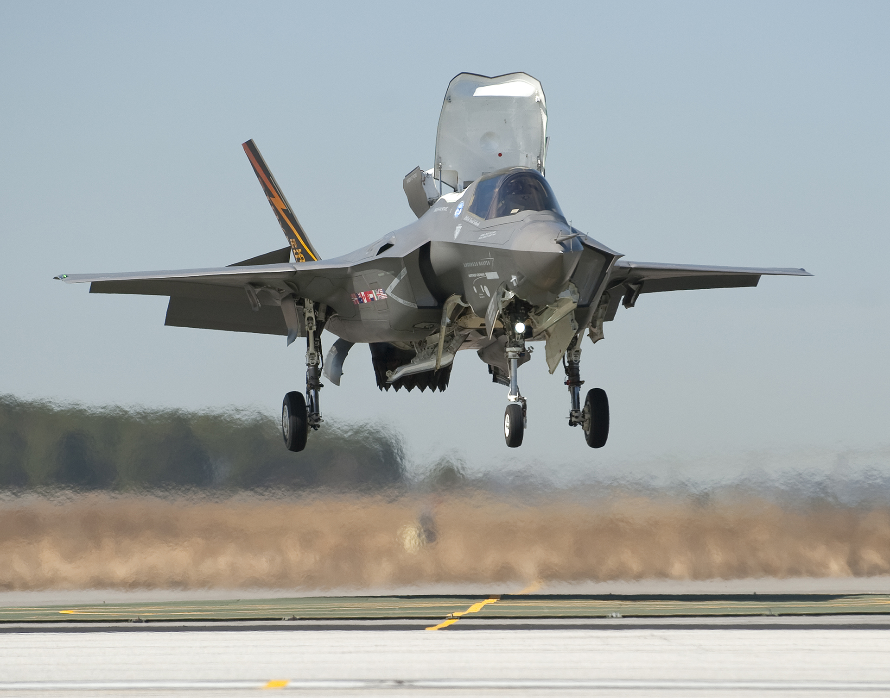
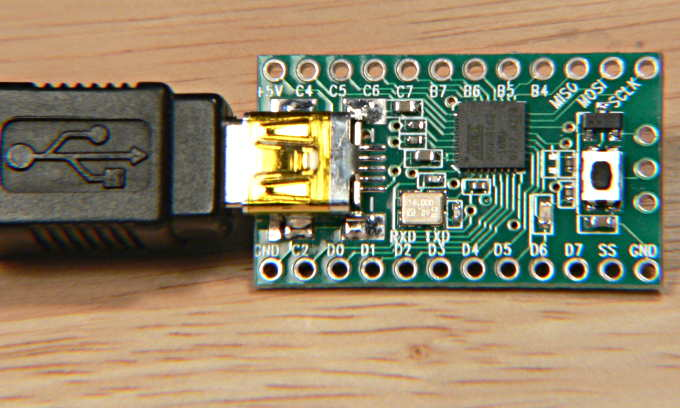

# F-35 RC Plane

 My friend and I, thought the [F-35](https://en.wikipedia.org/wiki/Lockheed_Martin_F-35_Lightning_II) VTOL was really cool.
 If you watch the video F-35 taking off vertically with its bent nozzle, it's just insane.
 So, as an engineer, we decided to make it!

## Plan

<iframe width="700" height="394" src="https://www.youtube.com/embed/HAXxXYPeVF8" title="YouTube video player" frameborder="0" allow="accelerometer; autoplay; clipboard-write; encrypted-media; gyroscope; picture-in-picture; web-share" allowfullscreen></iframe>

This is video made us tick to make our own F-35.
 https://www.youtube.com/@Joelmelanie
 Joel makes insanse VTOL RC planes, especially F-35 and Harrier.

Hardware was not the problem.
 Software was the problem.
 My friend an I are both in Mechanical Engineering, so we have nothing to do with Softwares.
 We started to search.

### Flight Controller
In order to make out plane stabilize automatically in the air, we need a flight controller.
  The most used flight controller is Pixhawk.
  It's basically an autopilot which includes much more functions than mere flight controller.
  You can expect the difference from their name.

Autopilot is a *pilot* which controls not only the position of the plane, but also the path and altitude of it.
 Flight Controller just controls the attitude of the plane. 

We decided to go with Pixhawk, because it had a lot of information on the internet, more functions and it's functions can be customed through a [ground station](https://ardupilot.org/copter/docs/common-choosing-a-ground-station.html).

We didn't have much knowledge about these flight controllers, ground station, firmware all these *systematic* stuffs.

So I read almost all the documents in [Pixhawk](https://docs.px4.io/main/en/), [Ardupilot](https://ardupilot.org/ardupilot/) and [related book](https://www.google.com/search?sxsrf=AB5stBgRWb5D3NrwvdVkej-g_C-inb3OLQ:1689406696141&q=pixhawk+book&tbm=isch&sa=X&ved=2ahUKEwjysoSwmpCAAxUSFogKHZm7AHcQ0pQJegQIDBAB&biw=774&bih=734&dpr=1.65#imgrc=B7kvdXj1sqTjnM) and watched a lot of You tube videos such as [Joel](https://www.youtube.com/@Joelmelanie), [Tom Stanton](https://www.youtube.com/@TomStantonEngineering), [LaLaRC](https://www.youtube.com/@LaLaRC), [Eric](https://www.youtube.com/@ericmaglio6540), etc.

If you do not have much knowledge about this drone controlling systems, you also have to go with a lot of researches. 

I will update the basic knowledge about drone systems later on in my [knowledge](/Knowledges/Knowledges).

After reading those documents, our pipeline was

make custom firmware --> upload via ground station --> upload it to our F-35 --> Ta-Da

Sounds easy? Huh? 
 **make custum firmware**: This was the hardship and almost all about F-35 VTOL 

## Challenges

Even though I read a lot of documents about Pixhawk and Ardupilot documents, it was nearly impossible to understand all the code lines because I was not a software developer.

I tried to clone and revise some codes from Pixhawk codes in Github,

There are massive lines of codes in PX4 Github.

Actually, it's not a matter of quantity, it's matter of my understanding.
 Eventhough there are documents out there, I couldn't fully understand it all because it's for at least intermediate software developers.

I tried to understand the codes by reading them line by line, but it seemed it was nearly impossible to make our own custom code.

I even DMed Joel to get some advice from him

Unfortunately, he didn't answer my DM :,'(

## Alternate way

### Drhem Flight

When I was struggling with the codes, my friend sent me a Youtube video.
  It was the video of F-35 VTOL by a guy called Nicholas Rehm.
<iframe width="750" height="394" src="https://www.youtube.com/embed/tlD0C5CrWcA" title="YouTube video player" frameborder="0" allow="accelerometer; autoplay; clipboard-write; encrypted-media; gyroscope; picture-in-picture; web-share" allowfullscreen></iframe> 

This video was the GAME CHANGER.

He provided not only the codes but all the configurations, hardware setup, radio connections.

We could just follow his documentation and video to build our F-35 and could draw our path to make F-35 VTOL very clearly.

Check out Rehm's [Github](https://github.com/nickrehm/dRehmFlight) and [Youtube channel](https://www.youtube.com/@NicholasRehm)
Especially, his PDF document is awsome in his Github page.
### Teensyduino

This tiny Microcontroller called [teensy](https://www.pjrc.com/teensy/index.html) operates using arduino codes, based on teensyduino extensions in arduino.

We ordered teensy 4.1 (Rehm recommended 4.1 when making VTOL aircraft)

It was time to build F-35 VTOL
